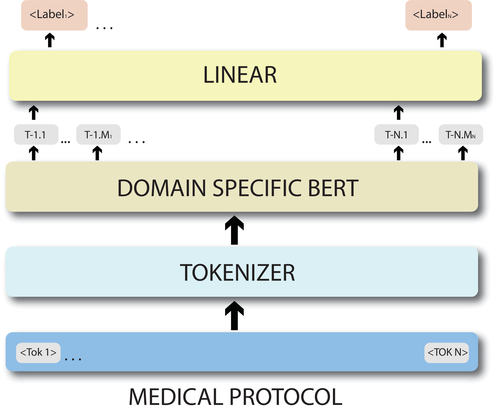

## Domain specific BERT representation for Named Entity Recognition of lab protocol
code for the system that secured 4 runner up at EMNLP 2020 workshop WNUT Shared Task-3

This Repo contains

- Code for Models. 
- Trained models used in the final submission. 
- Dependencies and steps to replicate results.

Relevant Links: [arxiv-pdf](https://arxiv.org/pdf/2012.11145.pdf) | [poster](https://github.com/noisy-text/noisy-text.github.io/blob/master/2020/posters/WNUT2020_92_poster%20-%20Tejas%20vaidhya.pdf)

For more detail refer [shared task website](http://noisy-text.github.io/2020/wlp-task.html)

Please cite with the following BiBTeX code:
```
@article{Vaidhya_2020,
   title={IITKGP at W-NUT 2020 Shared Task-1: Domain specific BERT representation for Named Entity Recognition of lab protocol},
   url={http://dx.doi.org/10.18653/v1/2020.wnut-1.34},
   DOI={10.18653/v1/2020.wnut-1.34},
   journal={Proceedings of the Sixth Workshop on Noisy User-generated Text (W-NUT 2020)},
   publisher={Association for Computational Linguistics},
   author={Vaidhya, Tejas and Kaushal, Ayush},
   year={2020}
}
```
**Authors:** [Tejas Vaidhya](https://github.com/tejasvaidhyadev) and [Ayush Kaushal](https://github.com/Ayushk4)

## Overview
### Abstract
Supervised models trained to predict properties from representations have been achieving high accuracy on a variety of tasks. For instance, the BERT family seems to work exceptionally well on the downstream task from NER tagging to the range of other linguistic tasks. But the vocabulary used in the medical field contains a lot of different tokens used only in the medical industry such as the name of different diseases, devices, organisms, medicines, etc. that makes it difficult for traditional BERT model to create contextualized embedding. In this paper, we are going to illustrate the System for Named Entity Tagging based on Bio-Bert. Experimental results show that our model gives substantial improvements over the baseline and stood the fourth runner up in terms of F1 score, and first runner up in terms of Recall with just 2.21 F1 score behind the best one.

## Dependencies and setup

| Dependency | Version | Installation Command |
| ---------- | ------- | -------------------- |
| Python     | 3.8     | `conda create --name covid_entities python=3.8` and `conda activate covid_entities` |
| PyTorch, cudatoolkit    | 1.5.0, 10.1   | `conda install pytorch==1.5.0 cudatoolkit=10.1 -c pytorch` |
| Transformers (Huggingface) | 2.9.0 | `pip install transformers==2.9.0` |
| Scikit-learn | 0.23.1 | `pip install scikit-learn==0.23.1` |
| scipy        | 1.5.0  | `pip install scipy==1.5.0` |
| NLTK    | 3.5  | `pip install nltk==3.5
` |

<!--
- python 3.8
```conda create --name covid_entities python=3.8``` & ```conda activate covid_entities```
- PyTorch 1.5.0, cudatoolkit=10.1
```conda install pytorch==1.5.0 cudatoolkit=10.1 -c pytorch```
- Huggingface transformers - 2.9.0
```pip install transformers==2.9.0```
- scikit-learn 0.23.1
```pip install scikit-learn==0.23.1```
- scipy 1.5.0
```pip install scipy==1.5.0```
- ekphrasis 0.5.1
```pip install nltk==3.5```

-->

## Model Description 


## Instruction for training the models
0. Set up the codebase and requirements
    -`git clone https://github.com/tejasvaidhyadev/W-NUT_2020.git` & `cd W-NUT_2020.`
    - Follow the instructions from the Dependencies and `set-up` above to install the dependencies.
1. Setup the dataset : Fllow instruction in `./data/README.md`

2. Recreating the experiment for the final submission:
    -run `python train.py` --dataset=proto (BERT model will be automatically chosen (for now Bio-BERT). It will instantiate a model and train it on the training set following the hyper-parameters specified in `experiment/proto/params.json`. )
    - preprocessing of Dataset for bert input refer `./data/Readme.md`

**We release the models weights for our final submission.**

- [**Bio-BERT model**](https://github.com/tejasvaidhyadev/W-NUT_2020/releases/download/v0.0.1/biobert-onfinaldata.zip)
- paste the extracted file in `./experiment/proto/`

## Model Performance 
Model Performance on test set released for final evaluation using organisers [script](https://github.com/jeniyat/WNUT_2020_NER/tree/master/code/eval) (exact match)
**On exact matches**

| Entity          | Precision | Recall | F1    |
| --------------- | --------- | ------ | ----- |
| Action          | 87.85     | 85.2   | 86.5  |
| Amount          | 72.25     | 93.78  | 81.62 |
| Concentration   | 84.27     | 91.21  | 87.6  |
| Device          | 65.2      | 58.4   | 61.61 |
| Generic-Measure | 28.74     | 40.34  | 33.57 |
| Location        | 62.89     | 71.14  | 66.76 |
| Measure         | 66.73     | 51.3   | 58.0  |
| Mention         | 66.43     | 64.14  | 65.26 |
| Method          | 45.98     | 42.53  | 44.19 |
| Modifier        | 73.33     | 46.43  | 56.86 |
| Numerical       | 66.15     | 49.62  | 56.7  |
| Reagent         | 80.47     | 84.13  | 82.26 |
| Seal            | 72.45     | 59.66  | 65.44 |
| Size            | 54.93     | 16.39  | 25.24 |
| Speed           | 87.01     | 92.08  | 89.47 |
| Temperature     | 92.94     | 86.58  | 89.65 |
| Time            | 90.27     | 86.13  | 88.15 |
|pH               |   95.16   | 89.39  | 92.19 |

**On partial matches **

| Overall         | Precision | Recall | F1    |
| --------------- | --------- | ------ | ----- |
| partial matches | 81.76     | 77.43  | 79.54 |
| exact matches   | 77        | 72.93  | 74.91 |


## Miscellanous

- You may contact us by opening an issue on this repo. Please allow 2-3 days of time to address the issue.
- The starter Code Credits: [BERT_NER](https://github.com/weizhepei/BERT-NER)

## License
MIT

