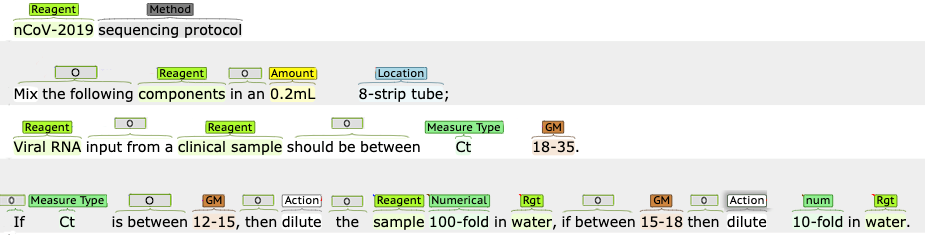

# Dataset Visualisation



## Submission Instructions

- Creat  Conll_format_merged by using /proto/test_data/Conll_format_Merged.ipynb

It wil creat the structure as shown in figure

 ```
	Conll_format_merged/
	  ├── protocol_0623_conll.txt
	  ├── protocol_0624_conll.txt
	  ├── protocol_0625_conll.txt
	  ├── protocol_0626_conll.txt
	  ├── ...
 ```

- copy the above file in the `../interactive/sentences/` #run `mkdir sentences` if sentnces folder is not there. It will generate the output files with the predicted tags 
 ```
	output_data/
	  ├── protocol_0623_conll.txt
	  ├── protocol_0624_conll.txt
	  ├── protocol_0625_conll.txt
	  ├── protocol_0626_conll.txt
	  ├── ...
 ```
- use `submit_format_generator.ipynb` to generate desire folder for shared task
```
	submission_output/
	  ├── protocol_0623_conll.txt
	  ├── protocol_0624_conll.txt
	  ├── protocol_0625_conll.txt
	  ├── protocol_0626_conll.txt
	  ├── ...
```
